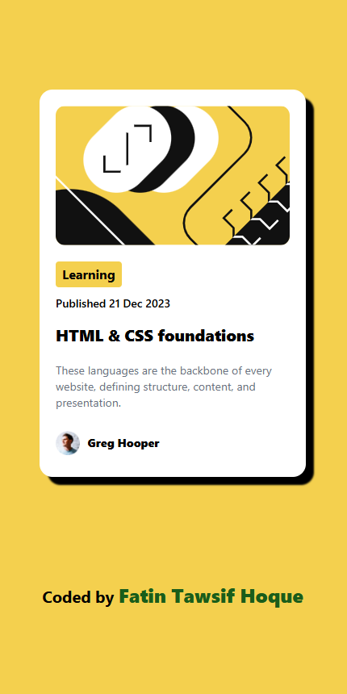
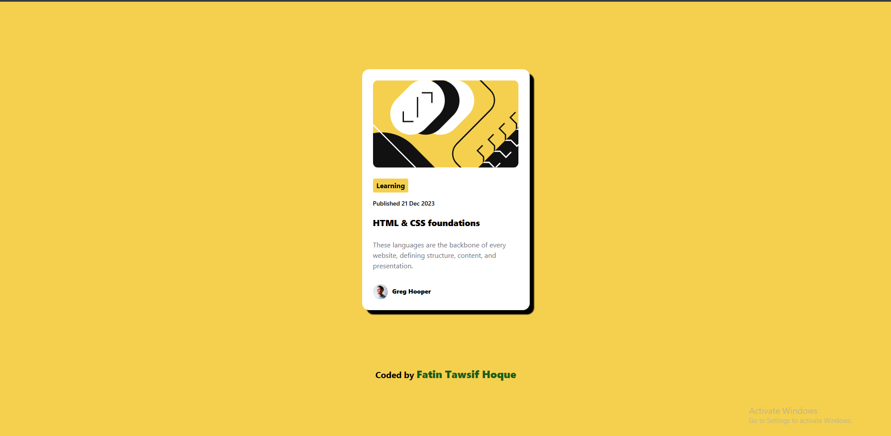
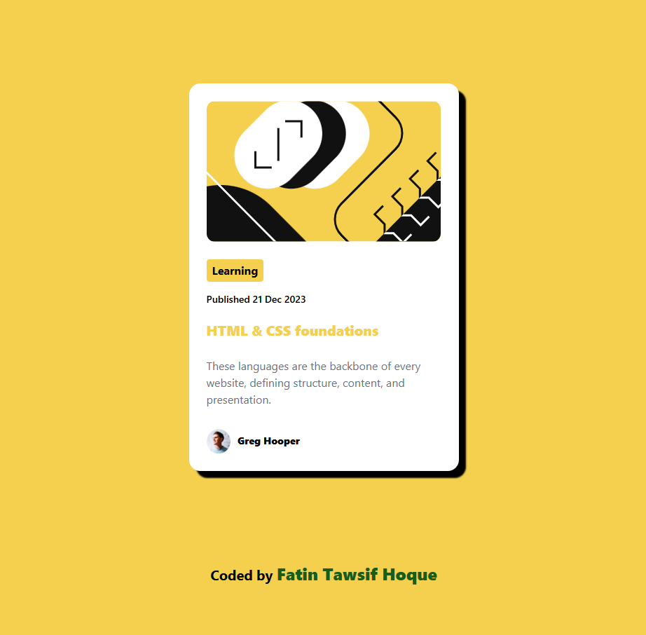

# Article Preview Component

A clean, responsive card component built with **HTML, CSS, and Tailwind CSS** — part of my journey through [Frontend Mentor](https://www.frontendmentor.io) challenges. This project helped me practice layout, spacing, typography, and responsive design using utility-first CSS.

> 💡 **coded by Fatin Tawsif Hoque**

---

## 🖼️ Preview

![Article Preview Component - Desktop, Mobile and Active View]

Mobile View - 

Desktop View - 

Active View - 

---

## 🛠️ Technologies Used

- **HTML5** – Semantic structure  
- **Tailwind CSS** – Utility-first styling (no custom CSS!)   
- **Frontend Mentor Design Files** – As reference

---

## 🌐 Live Demo

👉 [View live on Vercel](https://blog-preview-card-kwyf.vercel.app/)  

---

🙌 Feedback Welcome!
I’m actively building my frontend skills one challenge at a time. If you spot something I could improve — whether it’s code structure, accessibility, or best practices — I’d truly appreciate your feedback!

---